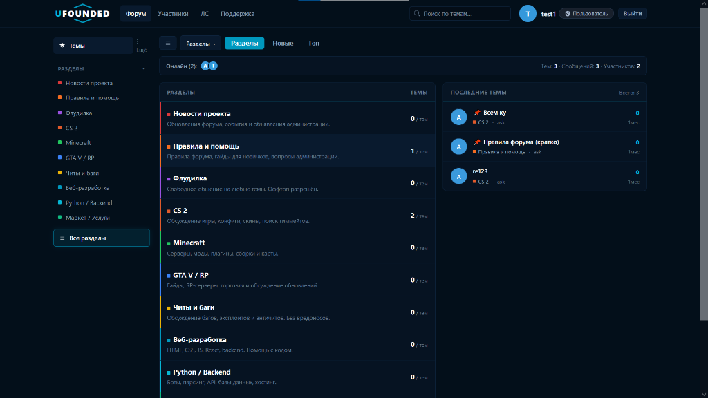

# Simple-Designed-Forume (UFounded)

Современный форум в тёмно-синем стиле с категориями, разделами, лентой последних тем, личными сообщениями, тикет-системой и **invite-only регистрацией**.



## Главные возможности

- **Современный тёмный дизайн**: тёмно-синяя неоновая палитра, левый сайдбар разделов с цветными маркерами, лента последних тем со счетчиками и относительным временем.
- **Инвайт-система**: регистрация строго по пригласительным кодам (создаёт администратор).
- **Система ролей и бейджей**: Администратор, Модератор, Саппорт, Пользователь.
- **Модерация**: премодерация публикаций с одобрением/отклонением.
- **Личные сообщения и Поддержка**: встроенные диалоги и тикет-чат.
- **Поиск**: мгновенный живой поиск по темам.

## Запуск

```bash
npm install
npm start
```

Откройте [http://localhost:3000](http://localhost:3000)

- **Администратор**: логин `ask`, пароль `1122`
- **Инвайт-код для регистрации**: `SKEETBESTCHEAT`
- Стартовый код приглашения `WELCOME-2026-ADMIN` доступен в панели администратора и может быть изменён или отключён.

## Что внутри

- Backend: Node.js + Express, хранилище `data.json` (без нативных модулей, работает везде).
- Auth: bcrypt + JWT (14 дней), токен в `localStorage`.
- API:
  - `POST /api/register` — `{username, password, inviteCode}` (код обязателен)
  - `POST /api/login`, `GET /api/me`
  - `GET /api/forums`, `GET /api/forums/:id/threads`, `POST /api/forums/:id/threads`
  - `GET /api/threads/:id`, `POST /api/threads/:id/posts`, `POST /api/posts/:id/like`
  - `GET /api/search?q=`, `GET /api/members`, `GET /api/stats`
  - Admin (только `role === 'admin'`):
    - `POST /api/admin/invites`, `GET /api/admin/invites`
    - `DELETE /api/admin/invites/:id`, `POST /api/admin/invites/:id/toggle`
    - `GET /api/admin/users`, `POST /api/admin/users/:id/role`
    - `POST /api/admin/threads/:id/pin|close`, `DELETE /api/admin/threads/:id`
- Frontend: SPA на чистом JS (`public/`), тёмная тема и хэш-роутинг.

## Структура

```
forume/
  server.js      — API + выдача фронта
  data.json      — создаётся автоматически (юзеры, инвайты, темы)
  public/
    index.html
    styles.css
    app.js
```
